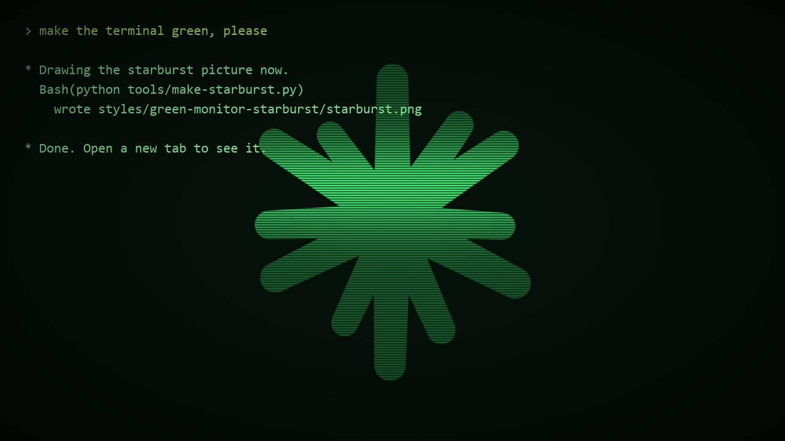
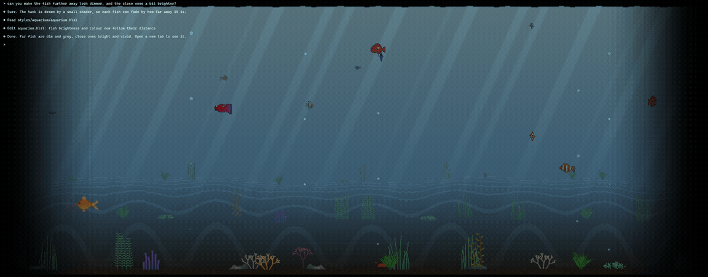

# Terminal themes

A collection of looks for **Windows Terminal**, mostly made for running Claude Code in. Each style is a
small shader (a file that repaints the terminal window) plus a colour scheme.

## The styles

Each style below has a short recording of it running, with a few lines of sample text. Every clip is
an exact loop: its last frame runs straight into its first.

### [`green-monitor-starburst`](styles/green-monitor-starburst/)

**The default.** An old green monitor: sharp letters with a soft glow, green glass, dark corners, and a
faint striped starburst behind the text, drawn as a flower with the rays as petals, with a light that
slowly runs down the screen over it.

### [`green-monitor`](styles/green-monitor/)

The same monitor without a picture: fine scanlines over the whole screen, a lighter band and the
rolling light.

### [`sharp-scanlines`](styles/sharp-scanlines/)

The simplest one: dark scanlines only, letters stay crisp. Pair it with any colour scheme. Shown here
at full size on the terminal's own Campbell scheme, so the lines are visible.

### [`aquarium`](styles/aquarium/)

**New, still being tuned.** A calm pixel-art fish tank behind the text, moving at about 5 frames a
second: light blue water that fades to black at the sides, a sea floor rolling into the distance,
swaying plants, rocks, rising bubbles, a crab, and two each of seven kinds of fish. The fish swim
sideways, turn, swim away (tail swinging) and come back towards you head-on, passing behind and in
front of the plants. Far-off fish are dim and grey; the closer one swims, the brighter and more
colourful it gets.

In the terminal the tank never repeats. For recording it has a loop mode (`LOOP_SECONDS` at the top
of `aquarium.hlsl`) that makes every movement repeat on the dot, so the clip joins up without a seam.

### [`halloween`](styles/halloween/)

**New for October.** A pixel-art graveyard night behind the text, with real depth: a big moon,
drifting clouds and witches on brooms flying across far away, two rows of hills with dead trees and
gravestones, a witch's hut on the left with a green-lit window, a smoking chimney and pumpkins on its
porch, a foggy field with zombies each swaying its own way as they shuffle slowly towards you,
candle-lit jack-o'-lanterns among the graves, two groups of big ones in the bottom corners turned to
look towards the middle (the biggest half hidden past the right edge), and spiders right on the glass, some dangling from the top on
a thread and some crawling about on the inside of the screen, so you see their undersides.

Every 45 seconds the top of the sky slowly darkens, then a big old-school sheet ghost rises in the
middle, its sheet streaming in the wind. Lightning keeps striking for as long as it stays: three big
strikes first, then more at uneven times, with small bolts flashing far off. Each flash swells,
flickers and fades. In the dark the zombies are black shapes; the lightning shows what they are.

The clip is shortened to 30 seconds, so the ghost leaves sooner than it does in the terminal.

**Use your own picture:** the starburst style takes any picture. Point
`experimental.pixelShaderImagePath` at your own image and the shader turns it green and striped. The
size and position are set at the top of `starburst.hlsl` (`PIC_SIZE`, `PIC_X`, `PIC_Y`).

**Or a moving one (GIF):** Windows Terminal cannot play a GIF behind a shader, so the frames are laid
out on one picture and the shader flips through them.

1. Run `python tools/gif-to-sheet.py my.gif my-sheet.png` (needs Pillow). It makes the sheet and
   prints four numbers.
2. Put those numbers at the top of `starburst.hlsl` (`SHEET_COLS`, `SHEET_ROWS`, `FRAME_COUNT`,
   `FRAME_SECONDS`).
3. Point `experimental.pixelShaderImagePath` at `my-sheet.png`.

To go back to a still picture, set the first three numbers back to `1`. The flower that comes with
the theme is a still picture.

## Install (green-monitor-starburst)

1. Download or clone this repo somewhere that will stay put.
2. Install the font: open [`fonts/ShareTechMono-Regular.ttf`](fonts/ShareTechMono-Regular.ttf) and
   click **Install**. It is free and included here under its open licence (see below). You can also get
   it from [Google Fonts](https://fonts.google.com/specimen/Share+Tech+Mono).
3. Open Windows Terminal → Settings → **Open JSON file**. Make a backup copy of it first.
4. From [`profile-snippet.json`](styles/green-monitor-starburst/profile-snippet.json), paste the
   `profile` into `profiles` → `list` and the `scheme` into `schemes`. Replace `<FOLDER>` with where
   you put this repo, **written with forward slashes** (`C:/Users/you/terminal-themes`).
5. Open a new tab with the **Green Monitor Claude** profile.

**Optional, for Claude Code:** save `claude-theme-robco.json` as `%USERPROFILE%\.claude\themes\robco.json`
and pick the RobCo theme with `/theme`. It draws your own messages on a hidden marker colour, which the
shader finds and turns a yellow-green, so you can tell your lines from Claude's at a glance.

## Install (aquarium)

1. Download or clone this repo somewhere that will stay put.
2. Open Windows Terminal → Settings → **Open JSON file**. Make a backup copy of it first.
3. From [`profile-snippet.json`](styles/aquarium/profile-snippet.json), paste the `profile` into
   `profiles` → `list` and the `scheme` into `schemes`. Replace `<FOLDER>` with where you put this
   repo, **written with forward slashes**. The font, Cascadia Code, comes with Windows Terminal.
4. Open a new tab with the **Aquarium Claude** profile.

The fish, plants and rocks are drawn in code by `styles/aquarium/aquarium-sprites.py` (needs
Pillow), which rewrites `aquarium-sheet.png` next to it. If you change the sheet's layout, change
the matching numbers at the top of `aquarium.hlsl` too.

## Install (halloween)

1. Download or clone this repo somewhere that will stay put.
2. Open Windows Terminal → Settings → **Open JSON file**. Make a backup copy of it first.
3. From [`profile-snippet.json`](styles/halloween/profile-snippet.json), paste the `profile` into
   `profiles` → `list` and the `scheme` into `schemes`. Replace `<FOLDER>` with where you put this
   repo, **written with forward slashes**. The font, Cascadia Code, comes with Windows Terminal.
4. Open a new tab with the **Halloween Claude** profile.

How often the ghost comes, how long it stays, how many zombies there are and the rest sit at the top
of `halloween.hlsl`. The pumpkins, zombies, witch, spiders, trees and gravestones are drawn in code by
`styles/halloween/halloween-sprites.py` (needs Pillow), which rewrites `halloween-sheet.png`. The
ghost, the lightning and the smoke are drawn by the shader itself. The shader is split in two:
`halloween-cast.hlsli` must stay next to `halloween.hlsl` if you copy them somewhere else.

## Tuning

Every number worth changing sits at the top of each `.hlsl` file with a comment saying what it does:
glow strength, how faint the picture is, how fast the light runs down, how dark the corners get.
Save the file and Windows Terminal reloads it straight away.

**Every style fades its picture to black at all four edges of the window** (`SCREEN_FADE`, or
`EDGE_FADE` in the Halloween style). The letters do not fade. New styles do the same.

## Remaking the pictures

- `python tools/make-starburst.py` redraws `starburst.png` (needs Pillow).
- `python tools/gif-to-sheet.py` turns a GIF into a frame sheet (see "Or a moving one" above).
- `python tools/make-preview.py` redraws the preview at the top of this page (needs Pillow and NumPy).
- The looping clips are recorded with the scripts in [`tools/preview-clips/`](tools/preview-clips/); its
  README has the steps.

## Disclaimer

This is a fan-made set of terminal themes. The starburst and the icons are our own drawings, made in
the spirit of the Claude logo; this project is **not** made by, endorsed by or connected to Anthropic.
Shaders use Windows Terminal's experimental pixel-shader feature, which may change or break in future
updates. If anything here should be credited or removed, the rights holder can open an issue and it
will be fixed quickly.

## Credits

- **Windows Terminal** (Microsoft) for the pixel-shader feature these styles are built on.
- **Share Tech Mono**, the font these styles use, designed by **Ralph du Carrois / Carrois Type Design**
  (now Carrois Apostrophe), [carrois.com](https://www.carrois.com). Free under the SIL Open Font
  License 1.1; the font file is included unchanged in [`fonts/`](fonts/) with its licence,
  [`fonts/OFL.txt`](fonts/OFL.txt). "Share" is a Reserved Font Name of its creator.
- Styles designed by Tefa, written by Claude.

If we used your work and you are not credited here, or credited wrongly, please open an issue and
we will fix it as soon as possible.
