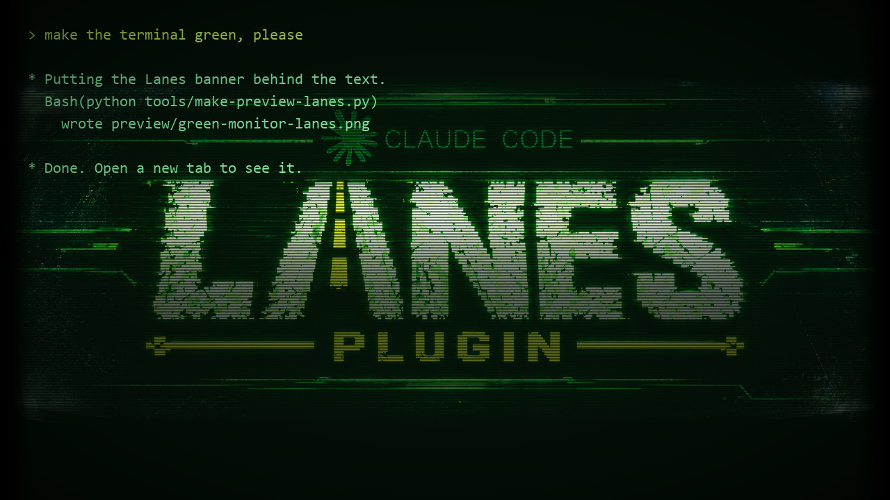
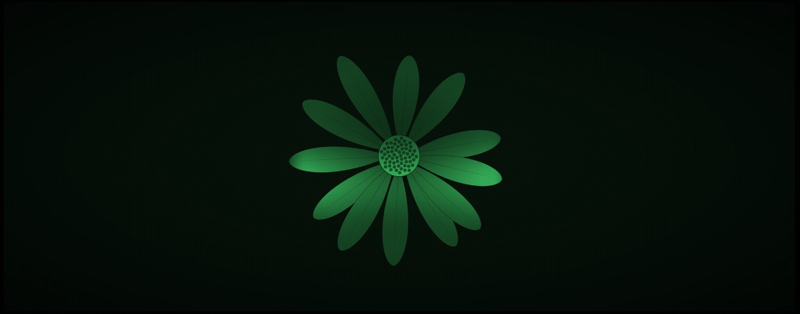
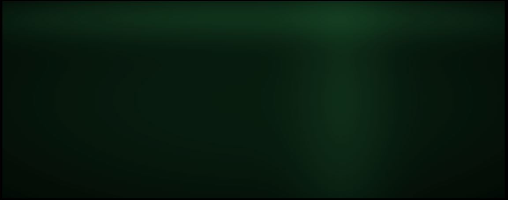
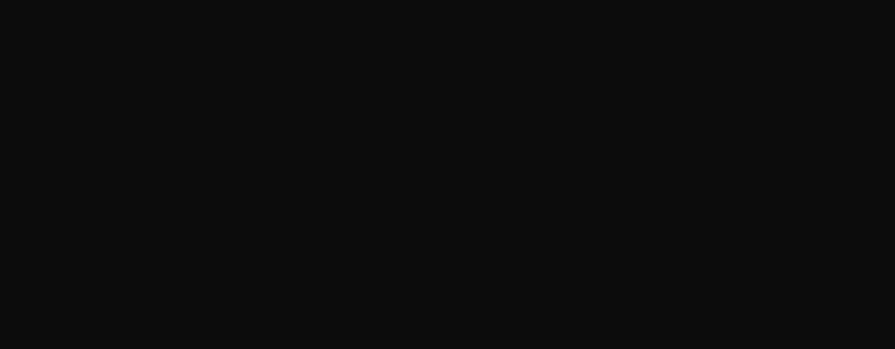
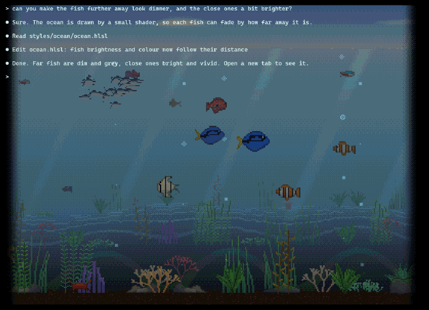
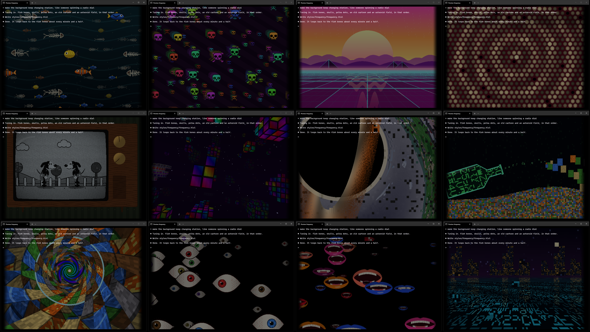
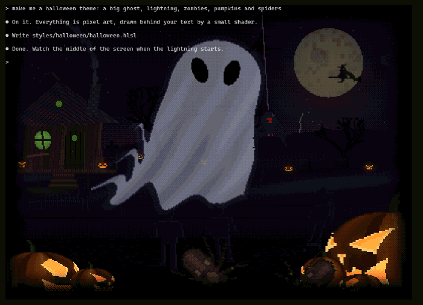

# Terminal themes

A collection of looks for **Windows Terminal**, mostly made for running Claude Code in. Each style is a
small shader (a file that repaints the terminal window) plus a colour scheme.

## The styles

Each style below has a short recording of it running, with a few lines of sample text. Every clip is
an exact loop: its last frame runs straight into its first.

### [`green-monitor-lanes`](styles/green-monitor-lanes/)

**The default since 2026-10-08, and the look the Lanes plugin ships with.** The same old green
monitor as the starburst below, but behind the text sits the Lanes Plugin banner, drawn in one dim,
striped green (no white, so the letters stay easy to read), with the light slowly running down the screen over it. The whole banner
fits across the window and stays centred as the window changes size.

### [`green-monitor-starburst`](styles/green-monitor-starburst/)

**The default until 2026-10-08.** An old green monitor: sharp letters with a soft glow, green glass, dark corners, and a
faint striped starburst behind the text, drawn as a flower with the rays as petals, with a light that
slowly runs down the screen over it.

### [`green-monitor`](styles/green-monitor/)

The same monitor without a picture: fine scanlines over the whole screen, a lighter band and the
rolling light.

### [`sharp-scanlines`](styles/sharp-scanlines/)

The simplest one: dark scanlines only, letters stay crisp. Pair it with any colour scheme. Shown here
at full size on the terminal's own Campbell scheme, so the lines are visible.

### [`ocean`](styles/ocean/)

**New, still being tuned** (it was the aquarium until 2026-10-01). A calm pixel-art view under the
sea behind the text, moving at about 5 frames a second. At the top, daylight: blue sky with a few
slow clouds over a still surface that only now and then rises or dips a cell, with sunlight glinting
on it. Below, light blue water fades to black at the sides, over a sea floor rolling into the
distance, with swaying plants, rocks, rising bubbles, a crab and a few soft light rays. Two each of
seven kinds of fish swim sideways, turn, swim away and come back towards you head-on, passing behind
and in front of the plants; far fish are dim and grey, near ones bright. A school of small silver
fish wanders through, turning almost as one, each fish a moment behind its neighbours. Now and then
a humpback whale glides across, far off or a little nearer, never close.

In the terminal the ocean never repeats. For recording it has a loop mode (`LOOP_SECONDS` at the top of `ocean.hlsl`) that
makes every movement repeat on the dot, so the clip joins up without a seam.

### [`frequency`](styles/frequency/)

**New, still being tuned.** A background that keeps changing station, as if someone were spinning a
radio dial, in very fine pixel art. It plays two stations, nearly three minutes in all, then glitches
back to its very first frame and starts again.

**The first station:**

1. Fish bones cross the screen in lanes, each lane at its own frame rate, from a jerky 2 frames a
   second to a smooth 60. Now and then a fish glitches into another: bones into a clownfish, a blue
   tang or a butterflyfish, and back.
2. The radio swaps station (static, wavy interference, the picture rolling away) to skulls in
   psychedelic colours flying diagonally at a smooth 30 frames a second.
3. The picture cracks into glowing boxes that crumble and fall away, showing a brighter world
   underneath: a striped sunrise with pyramids on the horizon, over a glassy grid floor with a finer
   grid between its lines, light running along them and the sun's reflection shimmering in it.
4. It glitches and swaps to polka dots humming on unstable electricity: brown-outs, surges that spit
   sparks, pulses of current running through them and a dark hum bar rolling up.
5. Another swap, to an old wooden TV on a papered wall, showing a black-and-white 1930s cartoon: a dog
   in trousers jogging from left to right with the camera following him, with film grain, scratches
   and flicker. Partway in he glitches into two: himself and his mirror image, copying each other
   step for step, drifting closer together and further apart.
6. A heavy glitch tears the picture apart and dives into a tiny distant pattern, a grid inside a grid,
   which opens into an asteroid field of cubes in "the fifth dimension", every block filled with its own
   wild colour, with lone single cubes floating between the clusters. The camera flies through and
   pans round, the rocks slowly swelling and shrinking, and now and then one glitches: its rows slide
   sideways, its colours flip and it blinks in and out. The lone cubes glitch most of all.

**The second station**, where nothing is quite right:

7. Three idyllic American suburbs in turn, seen from a distance: lawns, picket fences, bushes and
   mailboxes, and six kinds of house (plain, two-storey, low ranch, hipped roof, with a garage, steep
   A-frame), first by day, then at golden hour, then under a grey sky. In each a black hole emerges,
   with a glowing disk round it, bending and swirling the town into itself until it swallows the
   view, and the picture glitches into the next town. Each time the picture breaks into more pieces.
8. A huge digital bottle on the left tips to the right, shrinking as it goes, and pours out numbers
   and letters in an arc across the screen. They grow as they fly and turn into earth, rock, water,
   grass and lava, piling up until they fill the window.
9. Those elements form a tunnel that collapses in on itself as time warps, tiles crumbling away
   onto a second tunnel twisting the other way, while a hypnotic, colour-changing swirl spreads
   out of its middle and takes over, turning slowly, a long slow descent.
10. Everything glitches to black, and old green computer lines flicker on the screen.
11. Single eyes open one after another, scattered rather than in rows, big ones near and small dim
    ones far back, each looking its own way, until the window is full of them.
12. Each eye glitches into a laughing mouth, in its own way (sliced, flickering, pixelated, stretched
    or flashing colours). The mouths wear different lipsticks and laugh differently: cackling,
    guffawing, giggling, laughing like a maniac, or a trembling smile. Last of all a mouth appears
    small and far back in the middle, and grows until it swallows the scene, and the picture dives
    down its throat.
13. Out over an endless ocean of numbers and letters, many of them made up, under a night city built
    of letters, with a square moon. Then it glitches back to the fish bones.

All through the second station, small things are off: a moment replays itself now and then, a seam
runs down the picture, patches show coarse as if they had not finished loading, a building fails to
appear, and the skyline repeats itself.

On top of all that, short glitches in random psychedelic colours come and go at random moments and
for random lengths. Set `GLITCH_STRENGTH` to `0` at the top of `frequency.hlsl` to turn those off
(the planned changes of station stay). How long each part lasts is set there too.

### [`halloween`](styles/halloween/)

**New for October.** A pixel-art graveyard night behind the text, with real depth: a big moon,
drifting clouds and witches on brooms flying across far away, two rows of hills with dead trees and
gravestones, and a witch's hut on the left with pumpkins on its porch. Potions are brewing inside:
the window glow drifts from green to purple, pink and teal, and the chimney smoke carries whichever
colour the window had when it left, so the puffs climbing the sky match the brew. Now and then
something goes bang in quick purple or pink flashes that light up the hut, and that smoke takes the
bang's colour. A few stars sit scattered across the sky, never in rows.

Big gnarled trees stand in the field, mostly bare with a few dark green, yellow and red leaves
left, black against the night until lightning shows their bark, with a few lanterns swinging gently from
their lower branches that light the trunks and any spider dropping past, and a raven on top of each
that the first lightning strike scares into the air, and that comes back to the same branch once the
storm has passed; purple flowers grow round their
roots and across the grass. Zombies cross the field, passing behind and in front of the trees, each
with its own walk: some come straight at you, some at an angle, some shuffle sideways across the
field, some with arms held out in front and some with arms hanging and swinging, with a slight sway. Candle-lit jack-o'-lanterns stand
among the graves, with two groups of big ones in the bottom corners turned towards the middle. Now and
then a small spider scurries across the inside of the glass, so you see its underside, curving
smoothly as it turns; others let themselves down on a thread from the big trees' branches, and some climb the big
pumpkins, squeeze in at the corner of a mouth and climb out over the rim of an eye socket.

Every 45 seconds the top of the sky slowly darkens and an old-school sheet ghost appears, its sheet
streaming in the wind. Each visit is in one of ten places, near or far, big or small, drifting left
or right: from behind the hut or the big trees, far off behind the gravestones, or close enough to
fill half the window. Lightning keeps striking for as long as it stays: three big strikes
first, then more at uneven times, with small bolts flashing far off. Each flash swells, flickers and
fades, and shows the zombies in full.

The clip is shortened to 30 seconds, so the ghost leaves sooner than it does in the terminal.

**Use your own picture:** the starburst style takes any picture. Point
`experimental.pixelShaderImagePath` at your own image and the shader turns it green and striped. The
size and position are set at the top of `starburst.hlsl` (`PIC_SIZE`, `PIC_X`, `PIC_Y`).

**Or a moving one (GIF):** Windows Terminal cannot play a GIF behind a shader, so the frames are laid
out on one picture and the shader flips through them.

1. Run `python tools/gif-to-sheet.py my.gif my-sheet.png` (needs Pillow). It makes the sheet and
   prints four numbers.
2. Put those numbers at the top of `starburst.hlsl` (`SHEET_COLS`, `SHEET_ROWS`, `FRAME_COUNT`,
   `FRAME_SECONDS`).
3. Point `experimental.pixelShaderImagePath` at `my-sheet.png`.

To go back to a still picture, set the first three numbers back to `1`. The flower that comes with
the theme is a still picture.

## Install (green-monitor-lanes or green-monitor-starburst)

1. Download or clone this repo somewhere that will stay put.
2. Install the font: open [`fonts/ShareTechMono-Regular.ttf`](fonts/ShareTechMono-Regular.ttf) and
   click **Install**. It is free and included here under its open licence (see below). You can also get
   it from [Google Fonts](https://fonts.google.com/specimen/Share+Tech+Mono).
3. Open Windows Terminal → Settings → **Open JSON file**. Make a backup copy of it first.
4. From the style's `profile-snippet.json` ([lanes](styles/green-monitor-lanes/profile-snippet.json),
   [starburst](styles/green-monitor-starburst/profile-snippet.json)), paste the
   `profile` into `profiles` → `list` and the `scheme` into `schemes`. Replace `<FOLDER>` with where
   you put this repo, **written with forward slashes** (`C:/Users/you/terminal-themes`).
5. Open a new tab with the **Green Monitor Claude** profile.

**Optional, for Claude Code:** save `claude-theme-robco.json` as `%USERPROFILE%\.claude\themes\robco.json`
and pick the RobCo theme with `/theme`. It draws your own messages on a hidden marker colour, which the
shader finds and turns a yellow-green, so you can tell your lines from Claude's at a glance.

## Install (ocean)

1. Download or clone this repo somewhere that will stay put.
2. Open Windows Terminal → Settings → **Open JSON file**. Make a backup copy of it first.
3. From [`profile-snippet.json`](styles/ocean/profile-snippet.json), paste the `profile` into
   `profiles` → `list` and the `scheme` into `schemes`. Replace `<FOLDER>` with where you put this
   repo, **written with forward slashes**. The font, Cascadia Code, comes with Windows Terminal.
4. Open a new tab with the **Ocean Claude** profile.

The fish, plants and rocks are drawn in code by `styles/ocean/ocean-sprites.py` (needs Pillow; the
whale and the school fish are in `ocean-creatures.py`, next to it), which rewrites `ocean-sheet.png`.
If you change the sheet's layout, change the matching numbers at the top of `ocean.hlsl` too.

## Install (halloween)

1. Download or clone this repo somewhere that will stay put.
2. Open Windows Terminal → Settings → **Open JSON file**. Make a backup copy of it first.
3. From [`profile-snippet.json`](styles/halloween/profile-snippet.json), paste the `profile` into
   `profiles` → `list` and the `scheme` into `schemes`. Replace `<FOLDER>` with where you put this
   repo, **written with forward slashes**. The font, Cascadia Code, comes with Windows Terminal.
4. Open a new tab with the **Halloween Claude** profile.

How often the ghost comes, how long it stays, how many zombies there are and the rest sit at the top
of `halloween.hlsl`. The pumpkins, zombies, witch, spiders, trees and gravestones are drawn in code by
`styles/halloween/halloween-sprites.py` (needs Pillow; the walking zombies are posed as little 3D
figures in `halloween-zombies.py` and the big trees grown in `halloween-trees.py`, both next to it),
which rewrites `halloween-sheet.png`. The ghost, the lightning, the smoke and the flowers are drawn by
the shader itself. The shader is split in three: `halloween-cast.hlsli` and `halloween-trees.hlsli`
must stay next to `halloween.hlsl` if you copy them somewhere else.

## Install (frequency)

1. Download or clone this repo somewhere that will stay put.
2. Open Windows Terminal → Settings → **Open JSON file**. Make a backup copy of it first.
3. From [`profile-snippet.json`](styles/frequency/profile-snippet.json), paste the `profile` into
   `profiles` → `list` and the `scheme` into `schemes`. Replace `<FOLDER>` with where you put this
   repo, **written with forward slashes**. The font, Cascadia Code, comes with Windows Terminal.
4. Open a new tab with the **Frequency Claude** profile.

The fish bones, skulls, the cartoon dog and the letters are drawn in code by
`styles/frequency/frequency-sprites.py` (needs Pillow; the letters, real and made-up, come from
`frequency-glyphs.py` and the living fish from `frequency-livefish.py`, both next to it), which rewrites `frequency-sheet.png`. Everything else is drawn by
the shader itself, which is split in six: `frequency-scenes.hlsli`, `frequency-tv.hlsli`,
`frequency-space.hlsli`, `frequency-dream.hlsli` and `frequency-eyes.hlsli` must stay next to
`frequency.hlsl`. A new tab takes a few seconds to start the picture while the terminal builds it.

**A word of warning:** this style flashes and changes colour suddenly by design. If flashing
images bother you, set `GLITCH_STRENGTH` to `0`, or pick a calmer style.

## Tuning

Every number worth changing sits at the top of each `.hlsl` file with a comment saying what it does:
glow strength, how faint the picture is, how fast the light runs down, how dark the corners get.
Save the file and Windows Terminal reloads it straight away.

**Every style fades its picture to black at all four edges of the window** (`SCREEN_FADE`, or
`EDGE_FADE` in the Halloween style). The letters do not fade. New styles do the same.

## Remaking the pictures

- `python tools/make-starburst.py` redraws `starburst.png` (needs Pillow).
- `python tools/gif-to-sheet.py` turns a GIF into a frame sheet (see "Or a moving one" above).
- `python tools/make-preview.py` and `python tools/make-preview-lanes.py` redraw the starburst and Lanes
  previews (need Pillow and NumPy).
- The looping clips are recorded with the scripts in [`tools/preview-clips/`](tools/preview-clips/); its
  README has the steps.

## Disclaimer

This is a fan-made set of terminal themes. The starburst, the Lanes banner and the icons are our own artwork, made in
the spirit of the Claude logo; this project is **not** made by, endorsed by or connected to Anthropic.
Shaders use Windows Terminal's experimental pixel-shader feature, which may change or break in future
updates. If anything here should be credited or removed, the rights holder can open an issue and it
will be fixed quickly.

## Credits

- **Windows Terminal** (Microsoft) for the pixel-shader feature these styles are built on.
- **Share Tech Mono**, the font these styles use, designed by **Ralph du Carrois / Carrois Type Design**
  (now Carrois Apostrophe), [carrois.com](https://www.carrois.com). Free under the SIL Open Font
  License 1.1; the font file is included unchanged in [`fonts/`](fonts/) with its licence,
  [`fonts/OFL.txt`](fonts/OFL.txt). "Share" is a Reserved Font Name of its creator.
- Styles designed by Tefa, written by Claude.

If we used your work and you are not credited here, or credited wrongly, please open an issue and
we will fix it as soon as possible.
